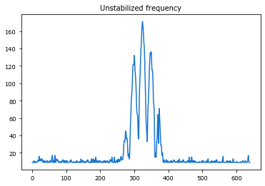
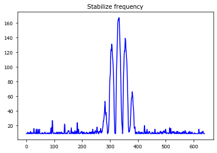

实验装置
====================

## 光路图
------------------------

## 实验材料
----------------------------

### 激光器
激光频率的稳定性很重要。模式比较差时，光斑的位置会漂，而且干涉条纹对比度很差。

下图是用小369激光器测得的干涉条纹



换用SHG369激光器，条纹干涉对比度变高



### 反射镜和透镜

要充分考虑到光斑大小，最好选2英寸的，防止挡光。

### 探针

#### CCD探针

我用的是watec 910hx超低照度黑白ccd，使用过程中有几个bug需要注意一下：

1. 用OpenCV读取CCD数据。注意不同电脑代码可能有些差异。

```python
import cv2
cap = cv2.VideoCapture(1) #1是设备号，从0开始数
```

或

```python
import cv2
cap = cv2.VideoCapture(1+cv2.CAP_DSHOW) #对小米笔记本，要加上cv2.CAP_DSHOW才有用。
```

Bug详情请参考这个帖子。

2. 采集图像时要运行两次cap.read()

第一次cap.read()采集的是上一次残留的数据，第二次read才是当下看到的数据。

3. DMD播放图片后，要先等0.1s，再采集图像，否则采集到切换中的残影图像。可能是因为ccd响应不够快。

#### PMT探针

PMT探针包括

- 10um 1050单模光纤
- 10um thorlabs小孔
- 3um 369单模光纤

将PMT接到数据采集卡的counter口，通过计数器统计固定时间内的脉冲数。程序如下：

```python
DAQ_counter = nidaqmx.Task()
DAQ_counter.ci_channels.add_ci_count_edges_chan(b"Dev1/ctr2")

def getPMTCounts3(t=0.1, counter=DAQ_counter, M=4):
    '''
    get counts in time duration t
    '''
    counts = []
    for i in range(M):
        N = int(1000.0 * t / 0.37)
        data = DAQ_counter.read(N)
        counts.append(data[-1] - data[0])
        
    return np.mean(counts)
```


